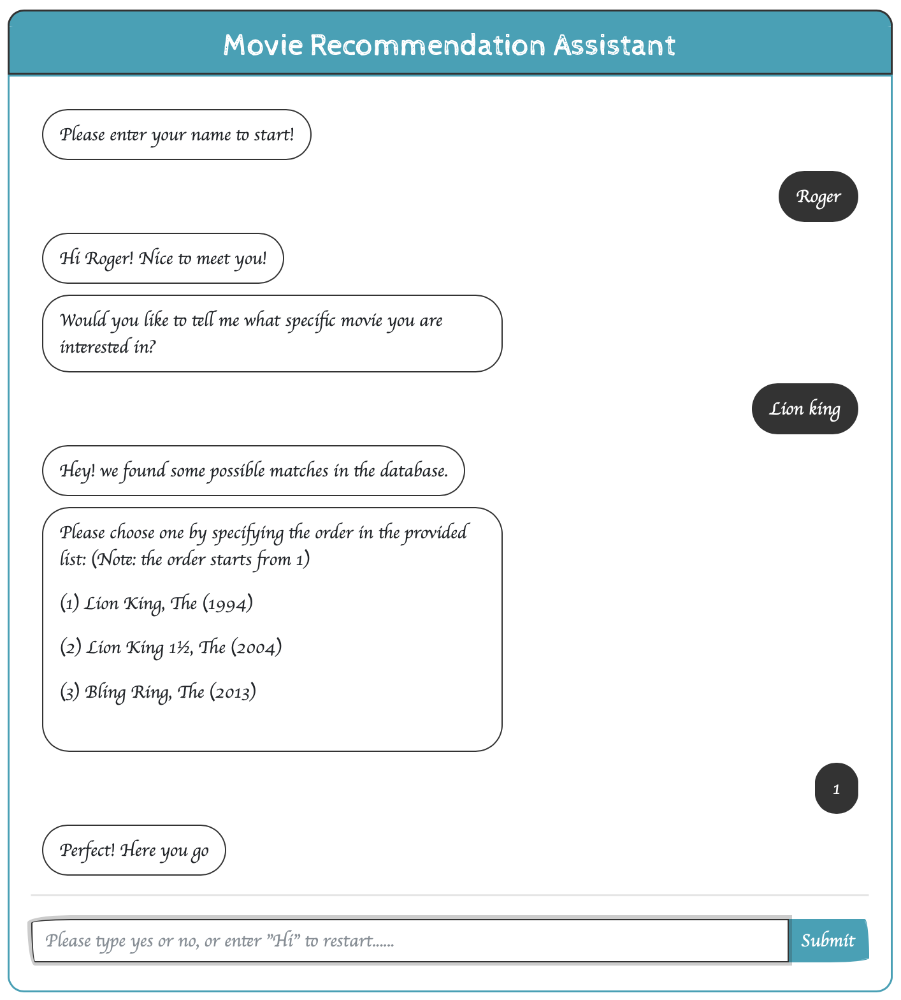
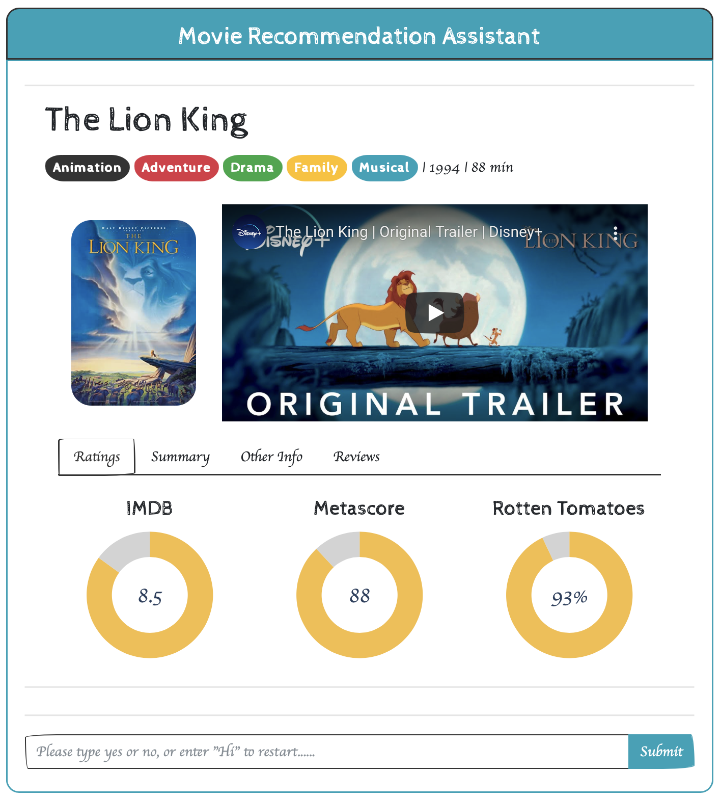
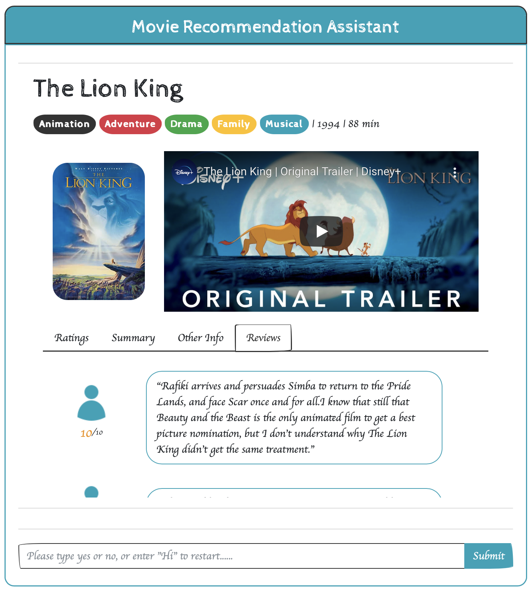
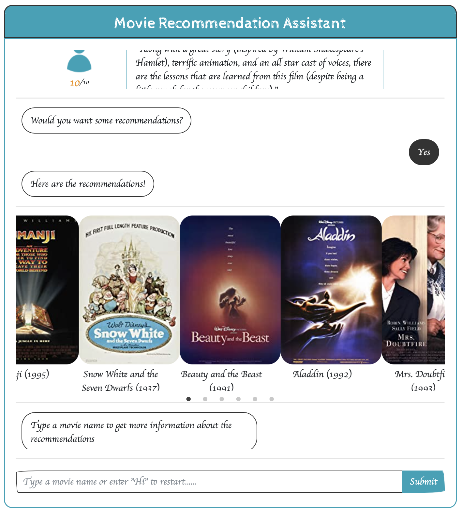
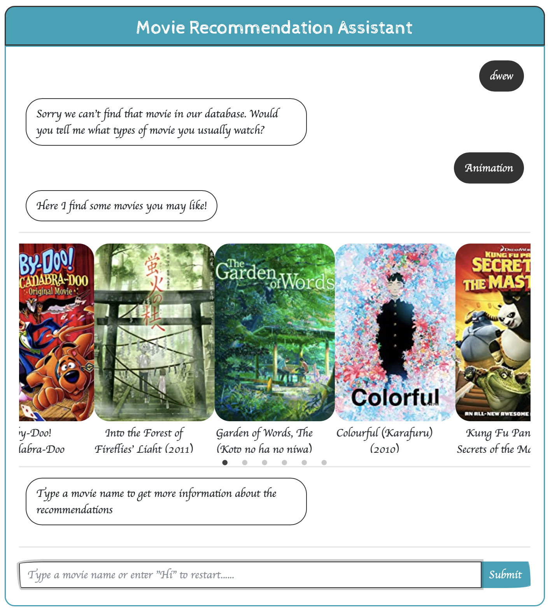

# Chatbot with Dash
### Topic: Virtual Movie Recommendation Assistant 
### Author: Roger Hung, Crystal lee
<br >
<strong>Chatbots are increasingly becoming common and a powerful tool to engage users by interacting with them in their natural language. Instead of searching all the movies information manually, which is not only time-consuming but lack of efficiency, we have deployed a simple chatbot by leveraging the power of dash that automates user conversations and helps the user find the movie of interest and what's more, provide recommendations based on the chosen movie. Although being a prototype, our chatbot is capable of looking up some detailed movie information and offer recommendations without any human assistance.</strong> <br >

<br >
This chatbot application contains 4 elements:

- Dash Application 
- Virtual Movie Recommendation Chatbot Assistant
- KNN Collaborative Filtering Recommender System 
- Movie Infomation Scraper 


#### 1. Start the conversation:


##### 2. See the selected movie overview: 


##### 3. Check other detailed information:


##### 4. Get the recommendations based on the movie you like:


##### 5. Support search by genre 


# Get Started

Running the dash app on your local server

```cmd
$python loan_app.py
```


